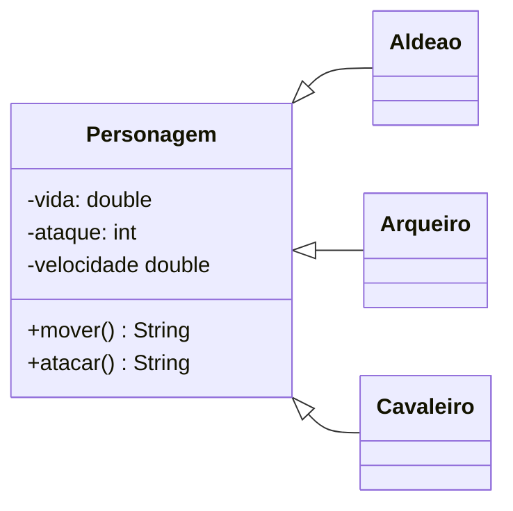

```mermaid
classDiagram
    direction LR
    
    Personagem <|-- Aldeao
    Personagem <|-- Arqueiro
    Personagem <|-- Cavaleiro
    
    class Personagem {
        -vida: double
        -ataque: int
        -velocidade double
        +mover() String
        +atacar() String
    }
 
    class Aldeao {
        
    }

    class Arqueiro {

    }

    class Cavaleiro {

    }

```