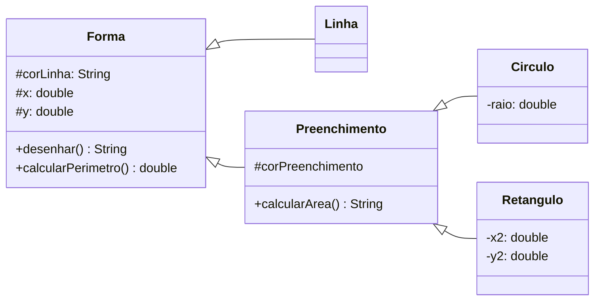

```mermaid
classDiagram
    direction LR
    
    Forma <|-- Linha
    Forma <|-- Preenchimento
    Preenchimento <|-- Circulo
    Preenchimento <|-- Retangulo
    
    class Forma {
        #corLinha: String
        #x: double
        #y: double
        +desenhar() String
        +calcularPerimetro() double
    }
    
    class Linha {
        
    }
    
    class Preenchimento {
        #corPreenchimento
        +calcularArea() String
    }
    
    class Circulo {
        -raio: double
    }
    
    class Retangulo {
        -x2: double
        -y2: double
    }
```