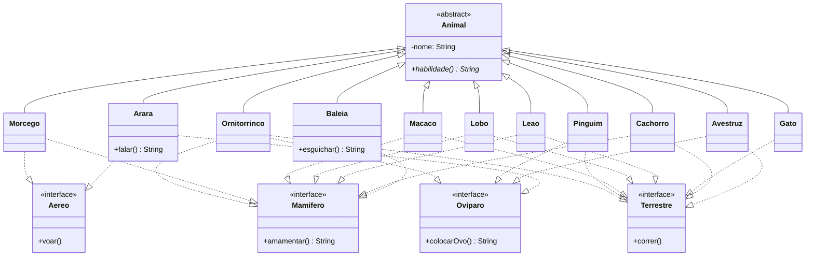

```mermaid
classDiagram
    
    Animal <|-- Arara 
    Animal <|-- Avestruz
    Animal <|-- Baleia
    Animal <|-- Cachorro
    Animal <|-- Gato
    Animal <|--  Leao
    Animal <|-- Lobo
    Animal <|-- Macaco
    Animal <|-- Morcego
    Animal <|-- Pinguim
    Animal <|-- Ornitorrinco
    Baleia ..|> Mamifero
    Cachorro ..|> Mamifero
    Leao ..|> Mamifero
    Lobo ..|> Mamifero
    Macaco ..|> Mamifero
    Morcego ..|> Mamifero
    Ornitorrinco ..|> Mamifero
    Avestruz ..|> Terrestre
    Cachorro ..|> Terrestre
    Gato ..|> Terrestre
    Leao ..|> Terrestre
    Lobo ..|> Terrestre
    Macaco ..|> Terrestre
    Pinguim ..|> Terrestre
    Ornitorrinco ..|> Terrestre
    Arara ..|> Aereo
    Morcego ..|> Aereo
    Arara ..|> Oviparo
    Avestruz ..|> Oviparo
    Pinguim ..|> Oviparo
    Ornitorrinco ..|> Oviparo
    

    
    class Animal {
        <<abstract>>
        -nome: String
        +habilidade() String*
    }
    
    class Mamifero {
        <<interface>>
        +amamentar() String
 }
    
    class Terrestre {
        <<interface>>
        +correr() 
    }
    
    class Aereo {
        <<interface>>
        +voar()
    }
    
    class Oviparo {
        <<interface>>
        +colocarOvo() String
    }
    
    class Arara {
        +falar() String
    }

    class Avestruz {

    }

    class Baleia {
        +esguichar() String
    }

    class Cachorro {
        
    }
    
    class Gato {
        
    }

    class Leao {
    
    }

    class Lobo {

    }

    class Macaco {

    }

    class Morcego {

    }

    class Pinguim {

    }

    class Ornitorrinco {

    }
```