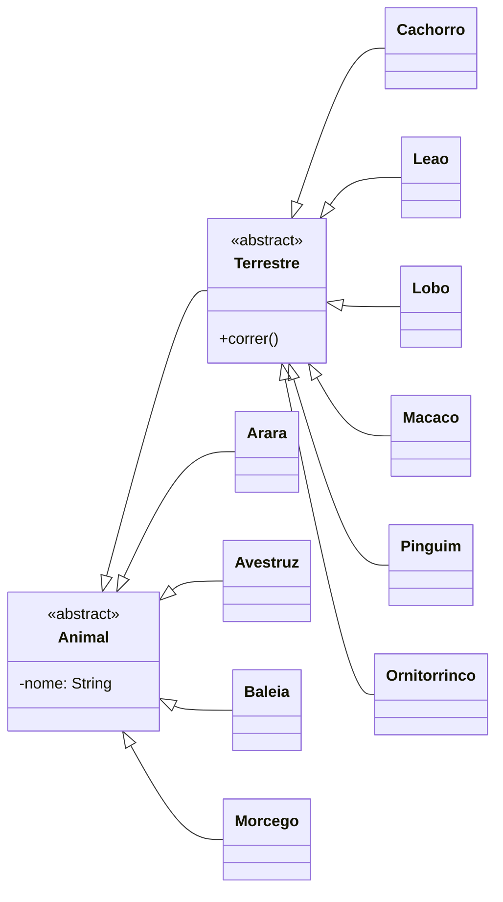

```mermaid
classDiagram
    direction LR
    
    Animal <|-- Terrestre
    Animal <|-- Arara
    Animal <|-- Avestruz
    Animal <|-- Baleia
    Animal <|-- Morcego
    Terrestre <|-- Cachorro
    Terrestre <|-- Leao
    Terrestre <|-- Lobo
    Terrestre <|-- Macaco
    Terrestre <|-- Pinguim
    Terrestre <|-- Ornitorrinco
    
    
    class Animal {
        <<abstract>>
        -nome: String
    }
    
    class Terrestre {
        <<abstract>>
        +correr() 
    }
    
    class Arara {
        
    }

    class Avestruz {

    }

    class Baleia {

    }

    class Cachorro {

    }

    class Leao {

    }

    class Lobo {

    }

    class Macaco {

    }

    class Morcego {

    }

    class Pinguim {

    }

    class Ornitorrinco {

    }
```